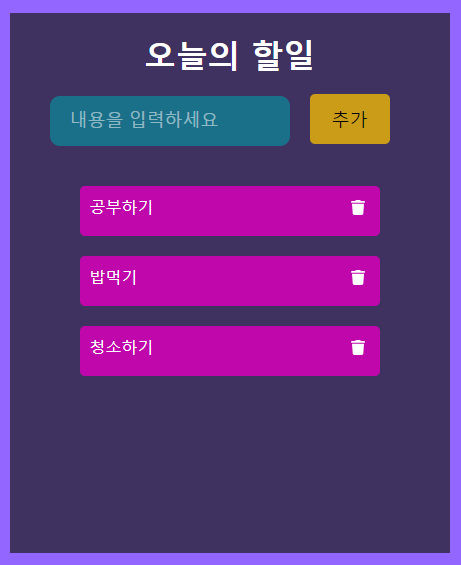

# TODO앱 만들기2(Ver. 2021/04/28)

</img>

* map과 filter를 도입하여 list와 delete기능을 좀 더 쉽게 구현 했습니다.
* svg 이미지같은경우에는 fontAwesome을 npm으로 다운받아 간편하게 사용 했습니다.
* 오늘은 TODO앱에서 Create와 Delete기능을 구현 해보았습니다.

[App.js]
```javascript
import { Component } from 'react';
import ListItems from './ListItems';
import './App.css';
// 휴지통 모양의 svg이미지를 사용하기위해 먼저 library를 import하고 faTrash를 import 합니다.
import { library } from '@fortawesome/fontawesome-svg-core';
import { faTrash } from '@fortawesome/free-solid-svg-icons';

// library에 faTrash를 추가시켜 선언해줍니다.
library.add(faTrash);

export default class App extends Component {
  constructor(props){
    super(props);
    this.state = {
      items: [],
      currentItem: {
        text: "",
        key: ""
      }
    }
    // 만들어둔 함수에서 this.setState를 사용할때 함수뒤에 bind(this)를 붙여줘야 오류가 안납니다.
    this.handleInput = this.handleInput.bind(this);
    this.addItem = this.addItem.bind(this);
    this.deleteItem = this.deleteItem.bind(this);
  }
  
  // input 태그에 값을 입력하면 setState가 작동되면서 안에있는 내용으로 state가 변경 됩니다.
  handleInput(e){
    this.setState({
      currentItem: {
        text: e.target.value, // 입력한 내용의 값
        key: Date.now() // 현재날짜의 값
      }
    });
  }
  // add버튼을 누르면 함수가 실행되면서 아래내용들이 적용 됩니다.
  addItem(e){
    e.preventDefault(); // button의 기존 기능(화면이 reload되는 현상)을 막는 역할을 합니다.
    const newItem = this.state.currentItem; // 현재 state의 currentItem값을 newItem이라는 변수로 저장 합니다.
    console.log(newItem); // input태그에 값을 입력하고 add버튼을 누르게되면 text와 key값이 newItem변수로 전달되는것을 확인 할 수 있습니다. 
    if(newItem.text !== ""){ // 입력된 text값이 없지않다면, 무엇이라도 입력되었다면 아래 코드가 실행 됩니다.
      const newItems = [...this.state.items, newItem]; // 기존의 배열 items를 복제해서 그안에 newItem내용으로 넣은뒤 newItems라는 변수로 저장 합니다.
      this.setState({
        items: newItems, // setState로 items값을 최종수정된 값으로 변경 합니다.
        currentItem: { // 목록을 추가한뒤에 다시 값을 입력하기전으로 초기화 합니다.
          text: "",
          key: ""
        }
      });
    }
  }
  // TODO앱의 delete기능을 담당하는 함수 입니다. 함수의 매개변수의 key는 자식 컴포넌트(ListItems.js)에서 보낸값을 받습니다.
  deleteItem(key){
      // filter는 괄호안의 조건을 충족시키는 요소만 리턴 해줍니다. 이 값들을 filteredItems 변수로 저장 합니다.
    const filterdItems = this.state.items.filter(item => item.key !== key)
    this.setState({ // 새로저장한변수로 items값을 변경 합니다.
      items: filterdItems
    });
  }

  render(){
    return (
      <div className="App">
        <header>
          <h1 id="to-do-title">오늘의 할일</h1>
          <form id="to-do-form" onSubmit={this.addItem}>
            <input 
              type="text" 
              placeholder="내용을 입력하세요" 
              value={this.state.currentItem.text}
              onChange={this.handleInput}
              >
            </input>
            <button type="submit">추가</button>
          </form>
        </header>
        <ListItems 
          items={this.state.items}
          deleteItem={this.deleteItem}
          >
        </ListItems>
      </div>
    );
  }
}
```

[ListItems.js]
```javascript
import { Component } from 'react';
import './ListItems.css';
import { FontAwesomeIcon } from '@fortawesome/react-fontawesome';

// 함수 style의 코드
// function ListItems(props) {
//     const items = props.items;
//     const listItems = items.map(item => {
//         return <div className="list" key={item.key}>
//             <p>{item.text}</p>
//         </div>
//     })
//     return(
//         <div>{listItems}</div>
//     )
// }

// export default ListItems;

// class style의 코드
export default class ListItems extends Component {
    render(){
        return(
            // map은 인자로 전달된 함수를 사용하여 배열 내부의 각 요소를 실행시키며 새로운 배열을 생성하여 반환 합니다.
            // 기존 배열을 복사하면서 반복문처럼 배열 내부의 요소들을 실행 시켜줍니다.
            this.props.items.map(item => {
                // 여기서 key값을 넣어줘야 각요소들에 index 0,1...가 부여 됩니다.
                return <div className="list" key={item.key}>
                        <p>
                            {item.text}
                            <span>
                                <FontAwesomeIcon 
                                    className="faicons" 
                                    icon="trash"
                                    onClick={function(){
                                        this.props.deleteItem(item.key)
                                    }.bind(this)}
                                    >
                                </FontAwesomeIcon>
                            </span>
                        </p>
                    </div>
            })
        );
    }
}
```
