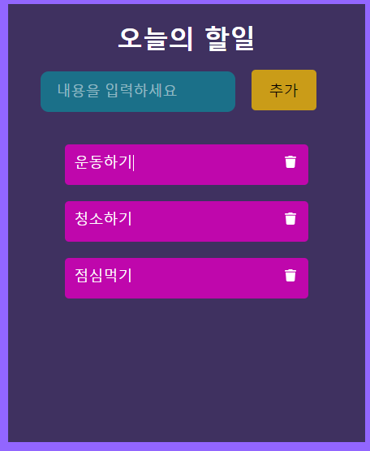
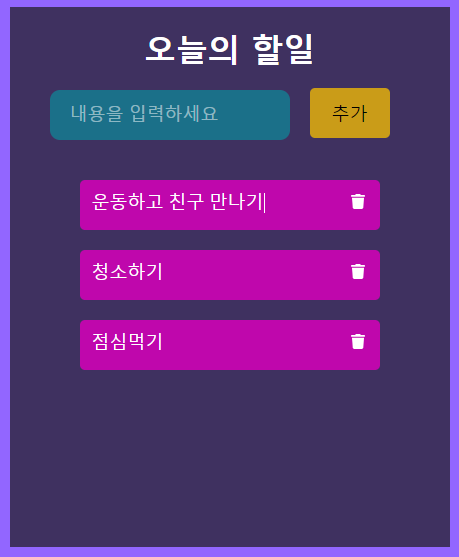

# TODO앱 만들기2(Ver. 2021/04/29)

</img>
</img>

* 오늘은 TODO앱에서 Update기능을 구현 해보았습니다.
* 할일목록을 추가하고 추가한 항목내용에 커서를 옮겨 내용을 수정 할 수 있습니다.

[App.js]
```javascript
import { Component } from 'react';
import ListItems from './ListItems';
import './App.css';
import { library } from '@fortawesome/fontawesome-svg-core';
import { faTrash } from '@fortawesome/free-solid-svg-icons';

library.add(faTrash);

export default class App extends Component {
  constructor(props){
    super(props);
    this.state = {
      items: [],
      currentItem: {
        text: "",
        key: ""
      }
    }
    this.handleInput = this.handleInput.bind(this);
    this.addItem = this.addItem.bind(this);
    this.deleteItem = this.deleteItem.bind(this);
    this.setUpdate = this.setUpdate.bind(this);
  }
  
  handleInput(e){
    this.setState({
      currentItem: {
        text: e.target.value,
        key: Date.now()
      }
    });
  }

  addItem(e){
    e.preventDefault();
    const newItem = this.state.currentItem;
    console.log(newItem);
    if(newItem.text !== ""){
      const newItems = [...this.state.items, newItem];
      this.setState({
        items: newItems,
        currentItem: {
          text: "",
          key: ""
        }
      });
    }
  }

  deleteItem(key){
    const filterdItems = this.state.items.filter(function(item) {return item.key !== key})
    this.setState({
      items: filterdItems
    });
  }

  // setUpdate함수의 매개변수는 자식 컴포넌트(ListItems)에서 보낸 값을 받습니다.
  // map을통해서 기존 items배열을 복사하고 if조건문을통해 key값이 같은요소만 자식 컴포넌트에서 전달한 텍스트로 수정하도록 합니다.
  setUpdate(text, key){
    const items = this.state.items;
    items.map(function(item){
      if(item.key === key){
        item.text = text
      }
      this.setState({ // 최종적인 items배열을 setState로 업데이트 시켜 줍니다.
        items: items
      });
    }.bind(this))
  }

  render(){
    return (
      <div className="App">
        <Header 
          onSubmit={this.addItem}
          value={this.state.currentItem.text}
          onChange={this.handleInput}
          >
        </Header>
        <ListItems 
          items={this.state.items}
          deleteItem={this.deleteItem}
          setUpdate={this.setUpdate} // props를 만들고 setUpdate라는 함수를 선언 해줍니다.
          >
        </ListItems>
      </div>
    );
  }
}

class Header extends Component {
  render(){
    return(
      <header>
        <h1 id="to-do-title">오늘의 할일</h1>
        <form id="to-do-form" onSubmit={this.props.onSubmit}>
          <input 
            type="text" 
            placeholder="내용을 입력하세요" 
            value={this.props.value}
            onChange={this.props.onChange}
            >
          </input>
          <button type="submit">추가</button>
        </form>
      </header>
    );
  }
}
```

[ListItems.js]
```javascript
import { Component } from 'react';
import './ListItems.css';
import { FontAwesomeIcon } from '@fortawesome/react-fontawesome';

// function ListItems(props) {
//     const items = props.items;
//     const listItems = items.map(item => {
//         return <div className="list" key={item.key}>
//             <p>{item.text}</p>
//         </div>
//     })
//     return(
//         <div>{listItems}</div>
//     )
// }

// export default ListItems;

export default class ListItems extends Component {
    render(){
        return(
            this.props.items.map(function(item) {
                return <div className="list" key={item.key}>
                            <p>   // 기존에는 item.text만 넣었다면 input태그의 text타입을통해 직접 입력하여 수정할 수 있게 했습니다.
                                  // onChange를 통해 입력된 값(text와 key)을 부모 컴포넌트에게 props로 전달 합니다.
                                <input 
                                    type="text" 
                                    value={item.text}
                                    onChange={function(e){
                                        this.props.setUpdate(e.target.value, item.key)
                                    }.bind(this)}
                                    >
                                </input>
                                <span>
                                    <FontAwesomeIcon 
                                        className="faicons" 
                                        icon="trash"
                                        onClick={function(){
                                            this.props.deleteItem(item.key)
                                        }.bind(this)}
                                        >
                                    </FontAwesomeIcon>
                                </span>
                            </p>
                        </div>
            }.bind(this))
        );
    }
}
```