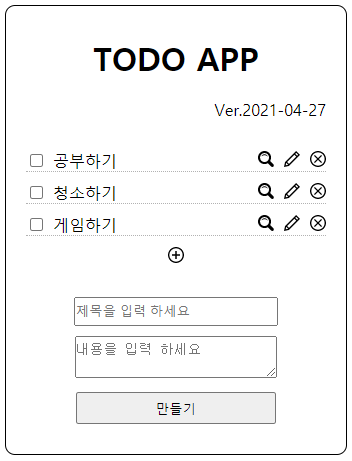
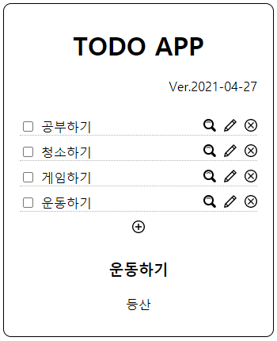

# TODO 앱 만들기 (VER.2021/04/27)

</img>
</img>

* CRUD 기능중 오늘은 Create기능을 구현했다.
* 더하기 버튼을 누르면 Article 영역이 입력할수있는 영역으로 바뀐다.
* 제목과 내용을 입력하고 만들기버튼을 누르면 새 목록이 추가된다.

[CreateContent.jsx]
```javascript
import { Component } from 'react';
// Article영역에 새 목록을 추가할내용을 입력하는 양식을위해 새로운 컴포넌트를 만들었다.
export default class CreateContent extends Component {
    render(){
        return(
            <article id="createContent_wrap">
                <form method="post" onSubmit={function(e){
                  // function에 매개변수로 e를주고 preventDefault() 함수를 선언하면 form태그가 가지고있던 기본기능을 막는다.
                    e.preventDefault();
                    // 조건문을 통해 값이 입력되지않을때 입력하라는 경고문구를 띄움
                    if(e.target.title.value === ""){
                        alert("제목을 입력 해주세요");
                    }else if(e.target.desc.value === "") {
                        alert("내용을 입력 해주세요");
                    } else {
                      // 입력된 내용을 onSubmit props로 값을 부모 컴포넌트에 전달
                      // 이때 onSubmit의 매개변수에서 e.target은 form태그를 title,desc은 form태그 자식요소들중 nmae이 title,desc인 태그, value는 입력된 값을 나타낸다.
                        this.props.onSubmit(e.target.title.value, e.target.desc.value);
                    }
                }.bind(this)} >
                    <p>
                        <input class="input" type="text" name="title" placeholder="제목을 입력 하세요"></input>
                    </p>
                    <p>
                        <textarea class="input" name="desc" placeholder="내용을 입력 하세요"></textarea>
                    </p>
                    <p>
                        <input class="input" type="submit" value="만들기"></input>
                    </p>
                </form>
            </article>
        );
    }
}
```

[Nav.jsx]
```javascript
import { Component } from 'react';

export default class Nav extends Component {
    render(){
      var lists = [];
      var data = this.props.data;
      for(var i = 0; i < data.length; i++){
        lists.push(
          <li key={data[i].id}>
            <input type="checkbox"></input>
            <a>{data[i].title}</a>
            <span id="nav_del"><svg xmlns="http://www.w3.org/2000/svg" width="16" height="16" viewBox="0 0 24 24"><path d="M12 2c5.514 0 10 4.486 10 10s-4.486 10-10 10-10-4.486-10-10 4.486-10 10-10zm0-2c-6.627 0-12 5.373-12 12s5.373 12 12 12 12-5.373 12-12-5.373-12-12-12zm6 16.538l-4.592-4.548 4.546-4.587-1.416-1.403-4.545 4.589-4.588-4.543-1.405 1.405 4.593 4.552-4.547 4.592 1.405 1.405 4.555-4.596 4.591 4.55 1.403-1.416z"/></svg></span>
            <span id="nav_upd"><svg xmlns="http://www.w3.org/2000/svg" width="16" height="16" viewBox="0 0 24 24"><path d="M1.439 16.873l-1.439 7.127 7.128-1.437 16.873-16.872-5.69-5.69-16.872 16.872zm4.702 3.848l-3.582.724.721-3.584 2.861 2.86zm15.031-15.032l-13.617 13.618-2.86-2.861 10.825-10.826 2.846 2.846 1.414-1.414-2.846-2.846 1.377-1.377 2.861 2.86z"/></svg></span>
            <span id="nav_rd">
              <svg
                xmlns="http://www.w3.org/2000/svg" width="16" height="16" viewBox="0 0 24 24"
                data-id={data[i].id}
                onClick={function(e){
                  e.preventDefault();
                  this.props.MyEvent(e.target.dataset.id);
                }.bind(this)}
                >
                <path 
                  d="M23.111 20.058l-4.977-4.977c.965-1.52 1.523-3.322 1.523-5.251 0-5.42-4.409-9.83-9.829-9.83-5.42 0-9.828 4.41-9.828 9.83s4.408 9.83 9.829 9.83c1.834 0 3.552-.505 5.022-1.383l5.021 5.021c2.144 2.141 5.384-1.096 3.239-3.24zm-20.064-10.228c0-3.739 3.043-6.782 6.782-6.782s6.782 3.042 6.782 6.782-3.043 6.782-6.782 6.782-6.782-3.043-6.782-6.782zm2.01-1.764c1.984-4.599 8.664-4.066 9.922.749-2.534-2.974-6.993-3.294-9.922-.749z"
                  data-id={data[i].id}
                  onClick={function(e){
                    e.preventDefault();
                    this.props.MyEvent(e.target.dataset.id);
                  }.bind(this)}
                  />
              </svg>
            </span>
          </li>
        );
      }
      return (
        <div id="nav_wrap">
          <ul>
            {lists}
            <li>
            // Create기능을 담당하는 요소
              <span id="nav_pl">
              // svg이미지를 클릭하면 MyEvent2라는 props에 create라는 문자값을 부모 컴포넌트에게 전달
                <svg 
                  xmlns="http://www.w3.org/2000/svg" width="16" height="16" viewBox="0 0 24 24"
                  onClick={function(e){
                    e.preventDefault();
                    this.props.MyEvent2("create");
                  }.bind(this)}
                  >
                    <path 
                      d="M12 2c5.514 0 10 4.486 10 10s-4.486 10-10 10-10-4.486-10-10 4.486-10 10-10zm0-2c-6.627 0-12 5.373-12 12s5.373 12 12 12 12-5.373 12-12-5.373-12-12-12zm6 13h-5v5h-2v-5h-5v-2h5v-5h2v5h5v2z"/>
                </svg>
              </span>
            </li>
          </ul>
        </div>
      );
    }
  }
```

[App.jsx]
```javascript
import { Component } from 'react';
import Header from './components/Header';
import Nav from './components/Nav';
import ReadContent from './components/ReadContent';
import './App.css';
import CreateContent from './components/CreateContent';

export default class App extends Component {
  constructor(props){
    super(props);
    this.max_contents_id = 3; // 새 목록을 Create 할때 id를 부여하기위해 property를 임의로 만듦.
    this.state = {
      selected_content_id: 1,
      mode: "welcome",
      welcome: { title: "welcome", desc: "오늘의 할일을 관리해보세요!" },
      contents: [
        { id: 1, title: "공부하기", desc: "리액트 공부하기" },
        { id: 2, title: "청소하기", desc: "설거지,쓰레기 버리기" },
        { id: 3, title: "게임하기", desc: "로스트아크 하기" }
      ]
    }
  }
  getReadContent(){
    for(var i = 0; i < this.state.contents.length; i++){
      var data = this.state.contents[i];
      if(data.id === this.state.selected_content_id){
        return data
      }
    }
  }

  getContent(){
    var _title,
    _desc,
    _article,
    _content = null;
    if(this.state.mode === "welcome"){
      _title = this.state.welcome.title;
      _desc = this.state.welcome.desc;
      _article = <ReadContent title={_title} desc={_desc}></ReadContent>
    } else if(this.state.mode === "read"){
      _content = this.getReadContent();
      _article = <ReadContent title={_content.title} desc={_content.desc}></ReadContent>
    } else if(this.state.mode === "create"){ // 모드가 create일때 아래 내용을 표시해줌
      _article = <CreateContent onSubmit={function(_title, _desc){ // createContent 컴포넌트에서 props로 전달한 값을 매개변수로 받음
        this.max_contents_id = this.max_contents_id + 1; // 새 목록이 추가될때마다 id값이 +1씩 증가
        var _contents = Array.from(this.state.contents); // state의 contents배열을 새로 복사해서 사용
        _contents.push({ // 복사한 contents값에 createContents에서 입력한 값과 id값으로 임의로 만든 max_contets_id를 넣어줌
          id: this.max_contents_id,
          title: _title,
          desc: _desc
        });
        // 최종적으로 모드를 read로 바꿔주어 화면에 표시되도록하고 contents는 새로만든 _contents로 selected~id는 새로만든 목록의 id값을 넣어줌
        this.setState({
          mode: "read",
          contents: _contents,
          selected_content_id: this.max_contents_id
        });
      }.bind(this)}></CreateContent>
    }
    return _article;
  }
  render(){
    return (
      <div id="app">
        <Header></Header>
        <Nav 
          data={this.state.contents} 
          MyEvent={function(id){
            this.setState({
              mode: "read",
              selected_content_id: parseInt(id)
            });
          }.bind(this)}
          MyEvent2={function(_mode){
            this.setState({
              mode: _mode
            });
          }.bind(this)}
          >
        </Nav>
        {this.getContent()}
      </div>
    );
  }
}
```

* 에러사항: 값이 입력되지않을때 입력하라고 경고알림을 하도록했는데 space-bar를 입력하면 값으로 인식하여 비어보이는 새 목록이 만들어지는 오류가발생함

[CreateContent.jsx 에서]
```javascript
<article id="createContent_wrap">
    <form method="post" onSubmit={function(e){
        e.preventDefault();
        if(e.target.title.value === ""){
            alert("제목을 입력 해주세요");
        }else if(e.target.desc.value === "") {
            alert("내용을 입력 해주세요");
        } else {
            this.props.onSubmit(e.target.title.value, e.target.desc.value);
        }
    }.bind(this)}>

```