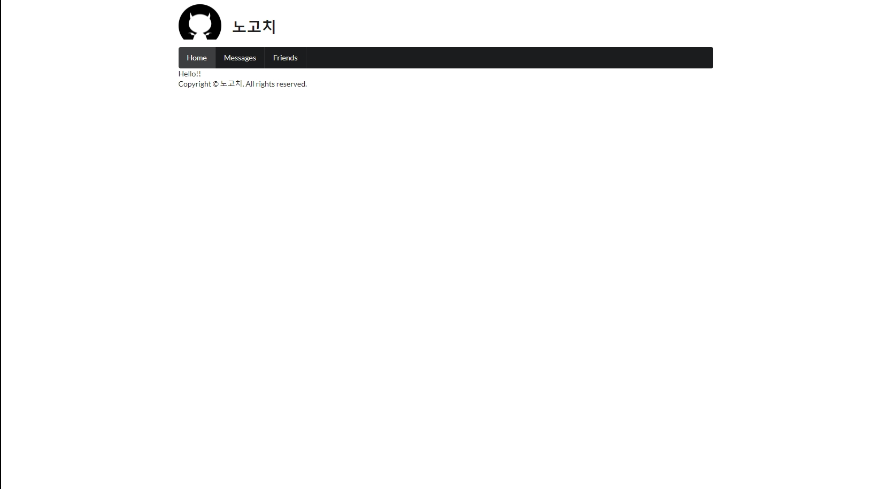

## nextjs tutorial(ver.2021/07/03)

</img>

* menu와같은 ui들은 semantic UI react에서 import하여 사용 했습니다.
* 각 요소들의 세부 css적용은 인라인방식을 채택하여 사용 했습니다.

[pages/_app.js]
```javascript
import '../styles/globals.css'
import 'semantic-ui-css/semantic.min.css'
import Footer from '../src/component/Footer';
import Top from '../src/component/Top';

function MyApp({ Component, pageProps }) {
  return (
  <div style={{ width: "1000px", margin: "0 auto" }}>
    <Top />
    <Component {...pageProps} />
    <Footer />
  </div>
  );
};

export default MyApp
```

[pages/index.js]
```javascript
import Head from 'next/head';
import styles from '../styles/Home.module.css';

export default function Home() {
  return (
  <div>
    <Head>
      <title>HOME | 노고치</title>
    </Head>
    <div>Hello!!</div>
  </div>
  );
}

// Next.js의 장점
// 1. 컴파일과 번들링이 자동으로 된다(webpack과 babel기능)
// 2. 자동 리프레쉬 기능으로 수정하면 화면에 바로 반영된다
// 3. 서버사이드 렌더링이 지원 된다
// 4. 스태틱 파일을 지원한다
```

[src/component/Top.js]
```javascript
import { Header } from 'semantic-ui-react';
import Gnb from './Gnb';

export default function Top() {
    return ( 
        <div>
            <div style={{ display: "flex", paddingTop: "20px" }}>
                <div style={{ flex: "0 0 100px" }}>
                    
                </div>
                <Header as="h1">노고치</Header>
            </div>
            <Gnb />
        </div>
    );
}
```

[src/component/Gnb.js]
```javascript
import { Menu } from "semantic-ui-react";

export default function Gnb() {
    const activeItem = "home";
    return(
        <Menu inverted>
            <Menu.Item
            name='home'
            active={activeItem === 'home'}
            // onClick={this.handleItemClick}
            />
            <Menu.Item
            name='messages'
            active={activeItem === 'messages'}
            // onClick={this.handleItemClick}
            />
            <Menu.Item
            name='friends'
            active={activeItem === 'friends'}
            // onClick={this.handleItemClick}
            />
        </Menu>
    );
};
```

[src/component/Footer.js]
```javascript
export default function Footer() {
    return <div>Copyright © 노고치. All rights reserved.</div>
}
```

[pages/_document.js]
```javascript
import Document, { Html, Head, Main, NextScript } from 'next/document'

class MyDocument extends Document {

  render() {
    return (
      <Html lang="ko">
        <Head />
        <body>
          <Main />
          <NextScript />
        </body>
      </Html>
    )
  }
}

export default MyDocument;

// next.js에서는 html,head,body과같은 document 태그들의 마크업들을 건너뛰고 페이지를 만들기때문에 _document.js를 통해 이 부분들을 수정할 수 있다.
```