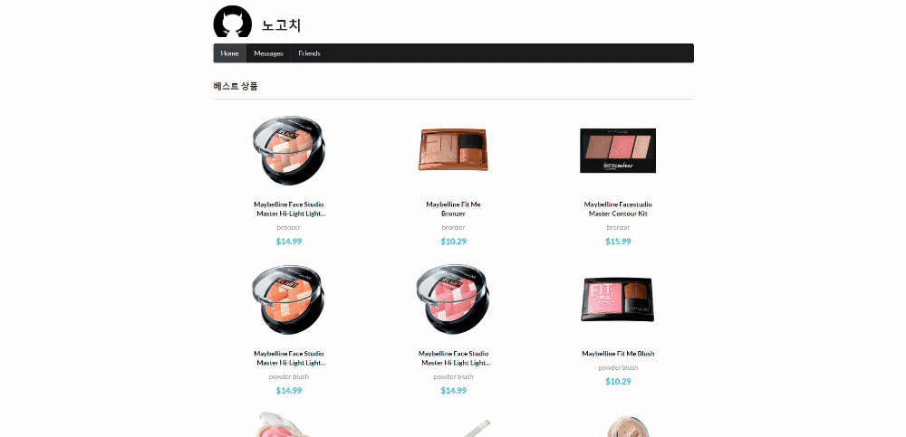

## nextjs tutorial(ver.2021/07/04)

</img>

* 오늘은 axios를 이용하여 화장품 api에서 데이터를 호출하고 Dynamic Routes와 next/link를 이용하여 화장품 상품페이지를 만들었습니다.
* 첫 화면 상품화면페이지는 map을 사용하여 나열하였고 slice를 사용하여 상품갯수를 조절했습니다.
* Dynamic Routes와 next/link를 사용하여 각 상품을 클릭했을때 상품 상세페이지가 보여지도록 했습니다.
* Dynamic Routes를 사용하면 id가 달라도 페이지하나로 관리하고 next/link를 사용하여 새로고침없이 페이지간 이동이 가능 합니다.

[pages/index.js]
```javascript
import Axios from 'axios';
import Head from 'next/head';
import { useEffect, useState } from 'react';
import ItemList from '../src/component/ItemList';
import { Header, Divider } from 'semantic-ui-react';
import styles from '../styles/Home.module.css';

export default function Home() {
  const [list, setList] = useState([]);

  const API_URL =
    "http://makeup-api.herokuapp.com/api/v1/products.json?brand=maybelline";

    function getData() {
      Axios.get(API_URL).then((res) => {
        console.log(res.data);
        setList(res.data);
      });
    };

    useEffect(() => {
      getData();
    }, []);

  return (
  <div>
    <Head>
      <title>HOME | 노고치</title>
    </Head>
    <Header as="h3" style={{ paddingTop: "40px" }}>
      베스트 상품
    </Header>
    <Divider />
    <ItemList list={list.slice(0, 9)} />
    <Header as="h3" style={{ paddingTop: "40px" }}>
      신상품
    </Header>
    <Divider />
    <ItemList list={list.slice(9)} />
  </div>
  );
}
```

[src/component/ItemList.js]
```javascript
import { Grid } from 'semantic-ui-react';
import styles from './ItemList.module.css';
import Link from 'next/link';

export default function ItemList({ list }) {
    return (
        <>
            <Grid columns={3}>
                <Grid.Row>
                    {list.map((item) => (
                        <Grid.Column key={item.id}>
                            <Link href={`/view/${item.id}`}>
                                <a>
                                    <div className={styles.wrap}>
                                        
                                        <strong className={styles.tit_item}>{item.name}</strong>
                                        <span className={styles.txt_info}>
                                            {item.category} {item.product_type}
                                        </span>
                                        <strong className={styles.num_price}>${item.price}</strong>
                                    </div>
                                </a>
                            </Link>
                        </Grid.Column>
                    ))}
                </Grid.Row>
            </Grid>
        </>
    );
};
```

[src/component/ItemList.module.css]
```css
.wrap {
    padding-bottom: 20px;
    text-align: center;
}

.img_item {
    display: block;
    margin: 0 auto;
}

.tit_item {
    display: -webkit-box;
    -webkit-line-clamp: 2;
    -webkit-box-orient: vertical;
    width: 160px;
    margin: 10px auto;
    overflow: hidden;
    color: #000;
}

.txt_info {
    display: block;
    margin-bottom: 10px;
    color: #999;
    text-align: center;
}

.num_price {
    font-size: 17px;
    color: #00bcd4;
    font-weight: bold;
}
```

[pages/view/id.js]
```javascript
import Axios from 'axios';
import { useEffect, useState } from 'react';
import { useRouter } from 'next/router';
import Item from '../../src/component/Item';

const Post = () => {
  const router = useRouter()
  const { id } = router.query

  const [item, setItem] = useState({});

  const API_URL =
  `http://makeup-api.herokuapp.com/api/v1/products/${id}.json`;

  function getData() {
    Axios.get(API_URL).then((res) => {
      console.log(res.data);
      setItem(res.data);
    });
  };

  useEffect(() => {
      if (id && id > 0) {
          getData();
      }
  }, [id]);

  return <Item item={item} />
}

export default Post;
```

[src/component/Item.js]
```javascript
import { Button, Header } from "semantic-ui-react";
import styles from './Item.module.css';

export default function Item({ item }) {
    const { image_link, name, price, description, category, product_type } = item;
    return (
        <>
            <div className={styles.wrap}>
                <div className={styles.img_item}>
                    
                </div>
                <div className={styles.info_item}>
                    <strong className={styles.tit_item}>{name}</strong>
                    <strong className={styles.num_price}>${price}</strong>
                    <span className={styles.txt_info}>
                        {category ? `${category}` : ""}
                        {product_type}
                    </span>
                    <Button color="orange">구매하기</Button>
                </div>
            </div>
            <Header as="h3">Description</Header>
            <p style={{ paddingBottom: "20px", fontSize: "18px" }}>{description}</p>
        </>
    );
};
```

[src/component/Item.module.css]
```css
.wrap {
    display: flex;
    padding: 40px 0;
    border-bottom: 1px solid #ccc;
}

.img_item {
    flex: 0 0 200px;
}

.img_item img {
    display: block;
}

.info_item {
    flex: 1 0 0;
}

.tit_item {
    display: block;
    font-size: 24px;
    margin-top: 20px;
}

.num_price {
    display: block;
    font-size: 34px;
    margin-top: 20px;
    color: #00bcd4;
}

.txt_info {
    display: block;
    font-size: 24px;
    margin: 20px 0 40px;
}
```