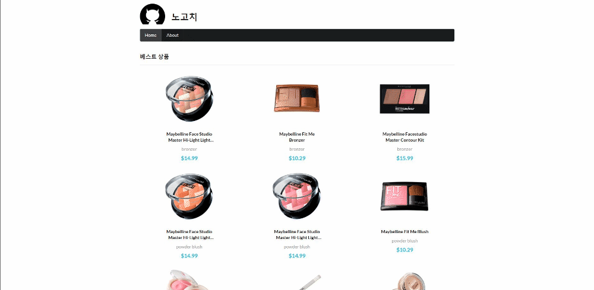

## nextjs tutorial(ver.2021/07/05)

</img>

* 오늘은 아래내용들을 추가작업 했습니다.

1. 첫 화면 렌더링전의 빈화면대신 Loading 화면추가
2. 상품 상페이지를 SSR(서버 사이드 렌더링)으로 바꾸기
3. 메뉴 탭(HOME, ABOUT)에 onClick 이벤트를주고 useRouter를 이용해 페이지이동 기능추가
4. about 페이지에 간단한 내용 넣어주기

[pages/index.js]
```javascript
import Axios from 'axios';
import Head from 'next/head';
import { useEffect, useState } from 'react';
import ItemList from '../src/component/ItemList';
import { Header, Divider, Loader } from 'semantic-ui-react';
import styles from '../styles/Home.module.css';

export default function Home() {
  const [list, setList] = useState([]);
  // Loading화면을 제어하기위해 state를 만듭니다.
  const [isLoading, setIsLoading] = useState(true);

  const API_URL =
    "http://makeup-api.herokuapp.com/api/v1/products.json?brand=maybelline";

    function getData() {
      Axios.get(API_URL).then((res) => {
        console.log(res.data);
        setList(res.data);
        // 첫 화면의 상품 목록데이터가 모두 불러와지면 Loading은 false가 됩니다.
        setIsLoading(false);
      });
    };

    useEffect(() => {
      getData();
    }, []);

  return (
  <div>
    <Head>
      <title>HOME | 노고치</title>
      <meta name="description" content="노고치 홈입니다."></meta>
    </Head>

    {/* Loading이 true이면 Loading화면이 표시 됩니다. */}
    {isLoading && (
      <div style={{ padding: "300px 0" }}>
        <Loader active>
          Loading
        </Loader>
      </div>
    )}

    {/* Loading이 false면 기존 상품목록이 나오는 home 페이지가 표시 됩니다. */}
    {!isLoading && (
      <>
        <Header as="h3" style={{ paddingTop: "40px" }}>
          베스트 상품
        </Header>
        <Divider />
        <ItemList list={list.slice(0, 9)} />
        <Header as="h3" style={{ paddingTop: "40px" }}>
          신상품
        </Header>
        <Divider />
        <ItemList list={list.slice(9)} />
      </>
    )}
  </div>
  );
}
```

[pages/view/id.js]
```javascript
import Axios from 'axios';
import Head from 'next/head';
import Item from '../../src/component/Item';

const Post = ({ item }) => {
  return (
    <>
      {item && (
        <>
          <Head>
            <title>{item.name}</title>
            <meta name="description" content={item.description}></meta>
          </Head>
          <Item item={item} />
        </>
      )}
    </>
  );
};

export default Post;

// 첫 화면(home 페이지)의 경우 CSR(클라이언트 사이드 렌더링) 방식으로 잠깐의 빈화면이 나타나는 CSR의 단점을 Loading화면을 넣어 자연스럽게 작동하도록 했습니다.
// 반면 상세페이지의경우 상품의 정보가 수시로 변경될 수있기때문에 항상 최신정보상태를 유지해야하고 사용자에게 가장 필요한 html정보들을 미리 준비되있어 기다림없이 빠르게 정보를 볼 수있어 SSR방식을 채택 했습니다.

export async function getServerSideProps(context) {
  const id = context.params.id;
  const apiUrl = `http://makeup-api.herokuapp.com/api/v1/products/${id}.json`;
  const res = await Axios.get(apiUrl);
  const data = res.data;

  return {
    props: {
      item: data,
    },
  };
};
```

[src/component/Gnb.js]
```javascript
import { Menu } from "semantic-ui-react";
import { useRouter } from "next/router";

export default function Gnb() {
    const router = useRouter();
    let activeItem;

    // router의 속성에서 pathname(파일경로)을 조건으로 사용하여 activeItem의 값을 바꿔줍니다.
    if (router.pathname === "/") {
        activeItem = "home";
    } else if (router.pathname === "/about") {
        activeItem = "about";
    }
    
    // 시맨틱 ui에서 제공하는기능으로 data라는 인자를 사용해서 data.name형식으로 데이터에 접근 할 수 있습니다.
    // name의 이름 조건에따라 router.push('')를 이용하여 페이지로 접근하게됩니다.
    function goLink(e, data) {
        if (data.name === "home") {
            router.push('/');
        } else if (data.name === "about") {
            router.push('/about');
        }
    }

    return(
        <Menu inverted>
            <Menu.Item
            name='home'
            active={activeItem === 'home'}
            onClick={goLink}
            />
            <Menu.Item
            name='about'
            active={activeItem === 'about'}
            onClick={goLink}
            />
        </Menu>
    );
};
```

[pages/about.js]
```javascript
// 시맨틱 ui react에서 간편하게 ui들을 사용 할 수 있습니다.
import { Button, Divider, Form, Header, List, TextArea } from "semantic-ui-react";
  
export default function About() {
return (
    <div>
        <Header as="h3" style={{ paddingTop: 40 }} color="teal">
            회사 소개
        </Header>
        <Divider />
        <List>
            <List.Item>
                <List.Icon name="users" />
                <List.Content>Semantic UI</List.Content>
            </List.Item>
            <List.Item>
                <List.Icon name="marker" />
                <List.Content>New York, NY</List.Content>
            </List.Item>
            <List.Item>
                <List.Icon name="mail" />
                <List.Content>
                    <a href="mailto:jack@semantic-ui.com">jack@semantic-ui.com</a>
                </List.Content>
            </List.Item>
            <List.Item>
                <List.Icon name="linkify" />
                <List.Content>
                    <a href="http://www.semantic-ui.com">semantic-ui.com</a>
                </List.Content>
            </List.Item>
        </List>
        <Header as="h3" style={{ paddingTop: 40 }} color="teal">
            문의 사항
        </Header>
        <Divider />
        <Form>
            <Form.Field>
                <label>제목</label>
                <input />
            </Form.Field>
            <Form.Field>
                <label>내용</label>
                <TextArea />
            </Form.Field>
            <Button color="green">보내기</Button>
        </Form>
    </div>
);
}
```