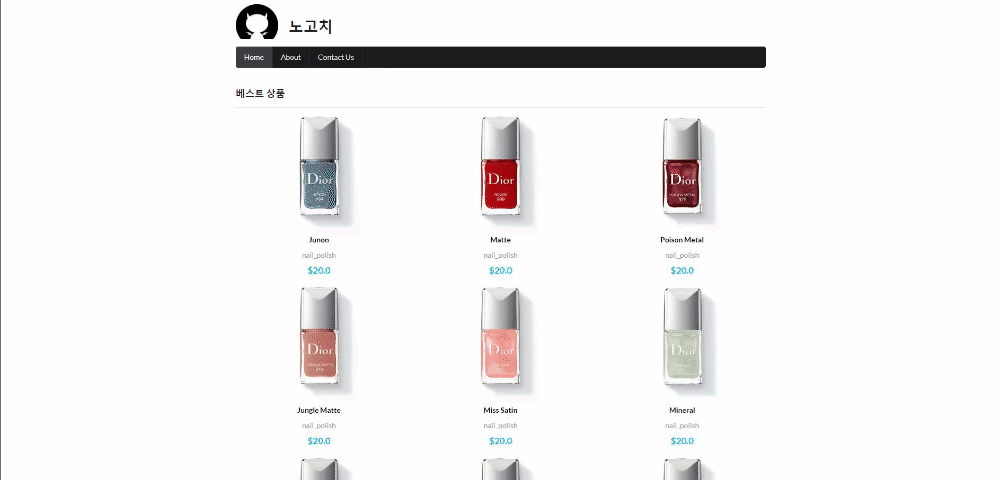

## nextjs tutorial(ver.2021/07/11)

[메인 홈화면을 정적 생성방식 도입(pre-rendering)]
</img>

* 오늘은 아래내용들을 추가작업 했습니다.

1. getStaticProps을 사용하여 메인화면페이지를 pre-rendering을하여 정적생성방식 도입
2. Static Generation과 Server-side Rendering의 차이점
-Static Generation: 이미 만들어진 html을 빌드시점에 바로 보여주어 로딩속도가 빠르다
(마케팅페이지, 블로그게시물, 제품목록, 문서 등)
-Server-side Rendering: 사용자가 요청을하면 html을 가져와 그려주기때문에 정적생성보다는 속도가느리지만 항상 최신상태 유지가능
(관리자페이지,분석차트 등)

[pages/index.js]
```javascript
import Axios from 'axios';
import Head from 'next/head';
import { useEffect, useState } from 'react';
import ItemList from '../src/component/ItemList';
import { Header, Divider, Loader } from 'semantic-ui-react';
import styles from '../styles/Home.module.css';

export default function Home({ list }) {
  return (
  <div>
    <Head>
      <title>HOME | 노고치</title>
      <meta name="description" content="노고치 홈입니다."></meta>
    </Head>
    <Header as="h3" style={{ paddingTop: "40px" }}>
      베스트 상품
    </Header>
    <Divider />
    <ItemList list={list.slice(0, 9)} />
    <Header as="h3" style={{ paddingTop: "40px" }}>
      신상품
    </Header>
    <Divider />
    <ItemList list={list.slice(9)} />
  </div>
  );
}

export async function getStaticProps() {
  const apiUrl = process.env.apiUrl;
  const res = await Axios.get(apiUrl);
  const data = res.data;

  return {
    props: {
      list: data,
      name: process.env.name
    },
  };
};
```

[.env.development]
```
name=DEVELOPMENT
NEXT_PUBLIC_API_URL=http://makeup-api.herokuapp.com/api/v1/products.json?brand=maybelline
apiUrl=http://makeup-api.herokuapp.com/api/v1/products.json?brand=maybelline
```

[.env.production]
```
name=PRODUCTION
NEXT_PUBLIC_API_URL=http://makeup-api.herokuapp.com/api/v1/products.json?brand=dior
apiUrl=http://makeup-api.herokuapp.com/api/v1/products.json?brand=dior
```