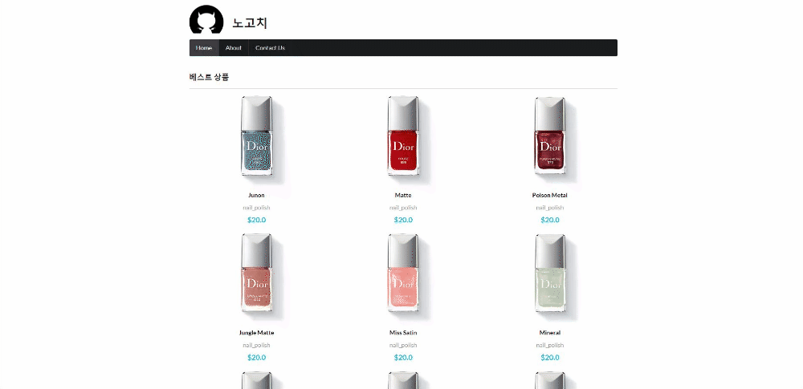

## nextjs tutorial(ver.2021/07/13)

[메인 홈화면을 정적 생성방식 도입(pre-rendering)]
</img>

* 오늘은 아래내용들을 추가작업 했습니다.

1. getStaticPaths를 사용하여 기존에 서버사이드렌더링 방식을 도입했던 상품상세페이지를 정적페이지로 전환
-지정 해놓은 페이지들은 빌드시점에 html,json파일들이 미리 만들어져있기때문에 페이지전환이빠름
-지정해놓지않은 페이지들도 클릭하면 html,json파일들이 만들어지고 다음번 클릭시 정적페이지로 전환

[src/component/ItemList.js]
```javascript
import { Grid } from 'semantic-ui-react';
import styles from './ItemList.module.css';
import Link from 'next/link';

export default function ItemList({ list }) {
    return (
        <>
            <Grid columns={3}>
                <Grid.Row>
                    {list.map((item) => (
                        <Grid.Column key={item.id}>
                            {/* getStaticPaths를 사용한 [id].js로 경로 변경 */}
                            <Link href="/detail/[id]" as={`/detail/${item.id}`}>
                                <a>
                                    <div className={styles.wrap}>
                                        
                                        <strong className={styles.tit_item}>{item.name}</strong>
                                        <span className={styles.txt_info}>
                                            {item.category} {item.product_type}
                                        </span>
                                        <strong className={styles.num_price}>${item.price}</strong>
                                    </div>
                                </a>
                            </Link>
                        </Grid.Column>
                    ))}
                </Grid.Row>
            </Grid>
        </>
    );
};
```

[pages/detail/id.js]
```javascript
import Axios from 'axios';
import Head from 'next/head';
import Item from '../../src/component/Item';

const Post = ({ item, name }) => {
  return (
    <>
      {item && (
        <>
          <Head>
            <title>{item.name}</title>
            <meta name="description" content={item.description}></meta>
          </Head>
          {name} 환경 입니다.
          <Item item={item} />
        </>
      )}
    </>
  );
};

export default Post;

export async function getStaticPaths() {
  return {
    // 설정된 id를 가진 페이지는 빌드시점에 미리 html,json파일들이 만들어지며 정적페이지로 전환됨(페이지 로드가 빠름)
    paths: [
      { params: { id: '740' } },
      { params: { id: '730' } },
      { params: { id: '729' } }
    ],
    // fallback을 false로 할경우 설정된 페이지를 제외한 다른 페이지들은 404 오류가 뜨게됨
    // true로 할경우 나머지 페이지들도 클릭이나 스크롤할때 화면상의 보이는 항목들도 html,json파일들이 만들어짐
    // 처음에 모든 데이터들을 전부 가져오는것이아니라 사용자가 접근하는 경로의 파일들만 로드되다보니 속도가 빠르다
    fallback: true,
  };
};

export async function getStaticProps(context) {
  const id = context.params.id;
  const apiUrl = `http://makeup-api.herokuapp.com/api/v1/products/${id}.json`;
  const res = await Axios.get(apiUrl);
  const data = res.data;

  return {
    props: {
      item: data,
      name: process.env.name
    },
  };
};
```