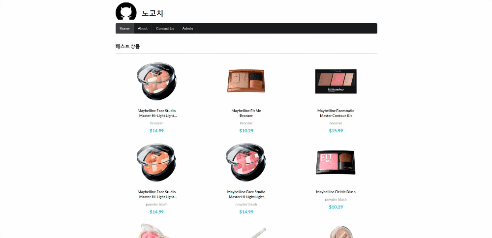

## nextjs tutorial(ver.2021/07/16)

[간단한 로그인,로그아웃 기능]
</img>

* 오늘은 아래내용들을 추가작업 했습니다.

1. next.js의 api를 사용하여 쿠키를 이용해 간단한 로그인기능을 추가했습니다.
2. 만들었던 api는 총 3가지 입니다.
-isLogin.js: admin페이지로 접근할때 isLogin에 name이 없으면 login 페이지로 넘어갑니다.
-login.js: login페이지에서 버튼을 onClick하면 Axios.post를 사용해서 login.js api가 실행되고 세팅해둔 쿠키 이름이 isLogin.js api에 저장되면서 admin페이지로 전환 됩니다.
-logout.js: admin페이지에 isLogin state값(false 또는 true)을 사용해서 로그인이 성공했을때는 true(true일때 admin페이지에 로그아웃버튼이 나오게함), 로그아웃버튼을 누르면 Axios.get을
사용해서 logout.js api를 가져와 실행되면서 쿠키 세팅값중 Max-Age=0 으로 설정했기때문에 즉시 쿠키가 삭제되면서 홈으로 이동하게됨

3. 만들었던 page는 총 2가지 입니다.
-admin.js: 로그인이 성공되었을때 보여지는 페이지
-login.js: 로그인이 안되어있을때 보여지는 페이지 

[pages/api/isLogin.js]
```javascript
export default function handler(req, res) {
  res.status(200).json({ name: req.cookies.a_name })
}
```

[pages/api/login.js]
```javascript
export default function handler(req, res) {
    // res.status(200).json({ name: null })
    if (req.method === "POST") {
        res.setHeader("Set-Cookie", "a_name=Mike;Max-Age=3600;HttpOnly,Secure")
        res.statusCode = 200;
        res.json({ message: "ok" });
    }
  }  
```

[pages/api/logout.js]
```javascript
export default function handler(req, res) {
    res.setHeader("Set-Cookie", "a_name=Mike;Max-Age=0;HttpOnly,Secure")
    res.statusCode = 200;
    res.json({ message: "ok" });
  }  
```

[pages/admin.js]
```javascript
import { useRouter  } from "next//router";
import { useEffect, useState } from "react";
import Axios from 'axios';
import { Button } from "semantic-ui-react";

export default function Admin() {
    const router = useRouter();
    const [isLogin, setIsLogin] = useState(false);

    function checkLogin() {
        Axios.get("/api/isLogin").then((res) => {
            if (res.status === 200 && res.data.name) {
                setIsLogin(true);
            } else {
                // 로그인 안됨
                router.push("/login");
            }
        });
    }

    function logout() {
        Axios.get("/api/logout").then((res) => {
            if(res.status === 200) {
                router.push("/");
            }
        });
    }

    useEffect(() => {
        checkLogin();
    }, []);

    return (
        <>
            admin
            {isLogin && <Button onClick={logout}>Logout</Button>}
        </>
    );
};
```

[pages/login.js]
```javascript
import { Button, Form } from "semantic-ui-react";
import { useRouter  } from "next//router";
import Axios from 'axios';

export default function Login() {
    const router = useRouter();
    function login() {
        Axios.post("/api/login").then((res) => {
            if (res.status === 200) {
                //로그인 성공
                router.push("/admin");
            }
        });
    }

    return (
        <div style={{ padding: "100px 0", textAlign: "center" }}>
            <Form>
                <Form.Field inline>
                    <input placeholder="ID" />
                </Form.Field>
                <Form.Field inline>
                    <input type="password" placeholder="Password" />
                </Form.Field>
                <Button onClick={login} color="blue">Login</Button>
            </Form>
        </div>
    );
}
```