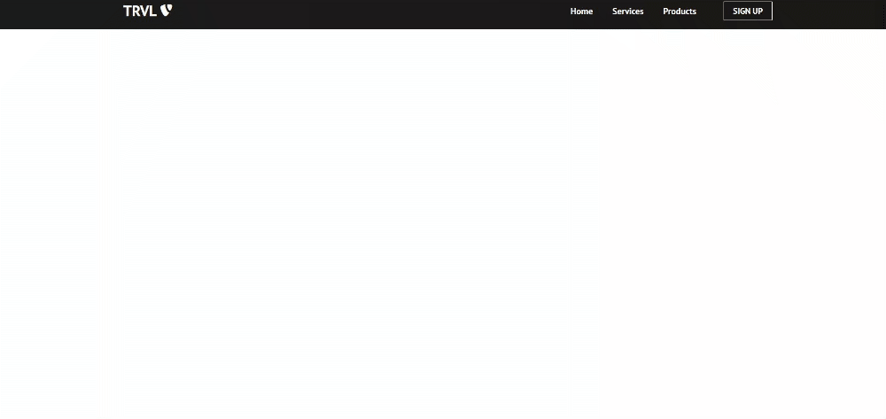

# React를 이용한 web site 만들기 튜토리얼(ver.2021/05/01)

</img>

* 오늘은 최상단에 nav 영역을 구현 해보았습니다.
* nav 영역은 좌측에는 로고영역, 우측에는 목록과 버튼으로 구성되어있습니다.
* 화면 width값이 960px을 기준으로 반응형이 되도록 작업 했습니다.

[App.js]
``` javascript
import React from 'react';
import NavBar from './components/NavBar';
// react-router-dom을 npm으로 설치하고 필요한 기능을 import 해줍니다.
import { BrowserRouter as Router, Switch, Route } from 'react-router-dom';
import './App.css';

function App() {
  return (
    <Router>
      <NavBar />
      <Switch>
        <Route path="/" exact />
      </Switch>
    </Router>
  );
}

export default App;
```

[NavBar.js]
``` javascript
// 함수 스타일의 컴포넌트에서도 state기능을 사용하게하는 useState 기능을 import 해줍니다.
import React, { useState } from 'react';
// 리액트 라우터에서 Link는 a태그와 같은 역할을 합니다.
import { Link } from 'react-router-dom';
import Button from './Button';
import './NavBar.css';

function NavBar() {
    // 배열의 첫번째 인자는 state의 현재의 상태, 두번째 인자는 기존 state값을 변경시키는 역할을 합니다.
    const [click, setClick] = useState(false);
    const [button, setButton] = useState(true);

    // handleClick 함수를 선언하면 setClick에의해 click의 현재 상태였던 false가 !click(불리언형태의 값을 뒤집음,즉 false에서 true로 변경)에 의해 true로 바뀝니다.
    const handleClick = () => setClick(!click);
    const closeMobileMenu = () => setClick(false);

    const showButton = () => {
        if(window.innerWidth <= 960) {
            setButton(false);
        } else {
            setButton(true);
        }
    };

    // 화면의 사이즈가 변동될때 showButton함수가 작동하면서 함수안의 내용(조건문)이 발동됩니다.
    window.addEventListener('resize', showButton);

    return (
        <nav className="navbar">
            <div className="navbar-container">
                <Link to="/" className="navbar-logo" onClick={closeMobileMenu}>
                    TRVL <i className="fab fa-typo3" />
                </Link>
                <div className="menu-icon" onClick={handleClick}> // 메뉴 아이콘을 클릭하는 이벤트를 통해 기존 click의 값을 true로 변경 합니다.
                    <i className={click ? 'fas fa-times' : 'fas fa-bars'} /> // click의 state값(false 또는 true)에 따라 아이콘 형태가 변경 됩니다.
                </div>
                <ul className={click ? 'nav-menu active' : 'nav-menu'}>
                    <li className="nav-item">
                        <Link to="/" className="nav-links" onClick={closeMobileMenu}>
                            Home
                        </Link>
                    </li>
                    <li className="nav-item">
                        <Link to="/Services" className="nav-links" onClick={closeMobileMenu}>
                            Services
                        </Link>
                    </li>
                    <li className="nav-item">
                        <Link to="/Products" className="nav-links" onClick={closeMobileMenu}>
                            Products
                        </Link>
                    </li>
                    <li>
                        <Link to="/sign-up" className="nav-links-mobile" onClick={closeMobileMenu}>
                            Sign Up
                        </Link>
                    </li>
                </ul>
                {button && <Button buttonStyle="btn--outline">SIGN UP</Button>}
            </div>
        </nav>
    )
}

export default NavBar;
```

[Button.js]
``` javascript
import React from 'react';
import './Button.css';
import { Link } from 'react-router-dom';

// 만들고싶은 css 클래스이름을 배열로 변수에 저장 합니다.(실제 css 작업과 내용은 별도로 import)
const STYLES = ['btn--primary', 'btn--outline'];

const SIZES = ['btn--medium', 'btn--large'];

// Button 함수형태의 컴포넌트 매개변수로 props를 설정 합니다.
function Button ({
    children,
    type,
    onClick,
    buttonStyle,
    buttonSize
}) {
    // STYLES 변수 안에 ButtonStyle이라는것이 존재유무를 true와 false에따라 css효과가 적용 됩니다.
    // STYLES 변수의 배열안에는 buttonStyle이라는 내용이 없어 false값을 반환하게되고 STYLES[0],즉 btn--primary값을 받습니다. 하지만 부모컴포넌트(NavBar.js)에서 Button 컴포넌트를 선언하면서 props로 ex) buttonStyle="btn--outline"을 적용하게되면 true값을 반환하게되고 btn--outline값을 받게 됩니다.
    const checkButtonStyle = STYLES.includes(buttonStyle) ? buttonStyle : STYLES[0];
    const checkButtonSize = SIZES.includes(buttonSize) ? buttonSize : SIZES[0];

    return (
        <Link to='/sign-up' className="btn-mobile">
            <button
            // `` 그레이브 기호는 자바스크립트에서 html을 표현하기위해 처음과 끝부분에 붙여주고 함수,state,props값을 표현할때는 ${} 로 표현 합니다.
                className={`btn ${checkButtonStyle} ${checkButtonSize}`}
                onClick={onClick}
                type={type}
            >
                {children}
            </button>
        </Link>
    );
};

export default Button;
```
