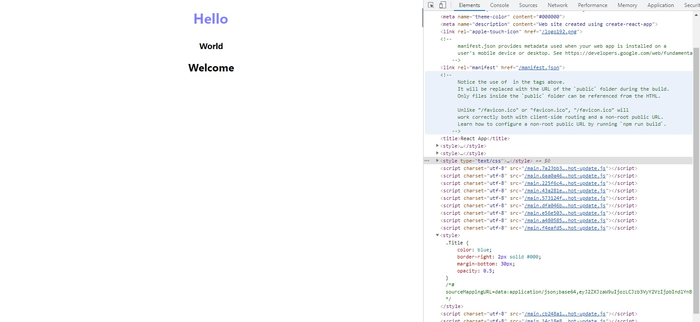
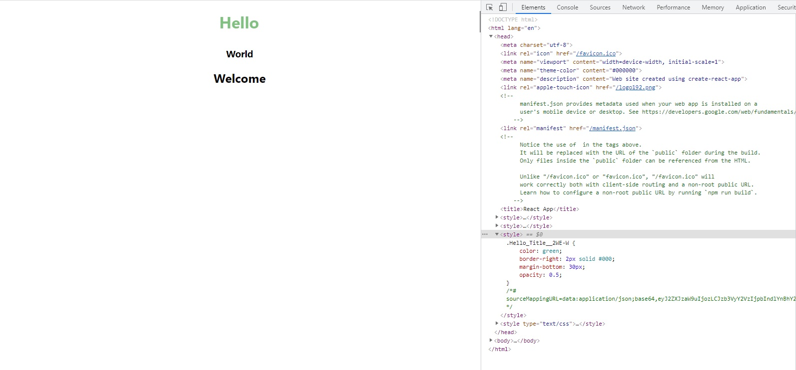

## React, Rest API를 이용한 VOCA 앱 만들기(ver.2021/06/15)

* 오늘은 리액트에서 css를 적용하는 3가지 방법을 알아봤습니다.

[첫 번째 방법: 인라인 형식-태그에 바로 적용하는 방식]
* TIP: 반드시 중괄호로 감싸주고 다시 객체안에다 CSS 속성을 입력함, border-right같이 dash바는  쓰지않고 제거후 borderRight 형태로 사용

</img>

[src/component/Hello.js]
```javascript
import World from "./World";

export default function Hello() {
    return (
        <>
            <h1 style={
                {
                    color: "#f00",
                    borderRight: "2px solid #000",
                    marginBottom: "30px",
                    opacity: 0.5
                }
            }>Hello</h1>
            <World />
        </>
    );
}
```

[두 번째 방법: css파일을 별도로 만들고 import 하기]
* 단점: 각각 컴포넌트에 종속되는것이아니라 실제로 개발자도구 엘리먼트탭에서 확인해보면 단순하게 <head> 태그안에 <style>로 정의만 되있어서 중복이 될 위험이 크다.

</img>

[src/component/Hello.js]
```javascript
import World from "./World";
import "./Hello.css";

export default function Hello() {
    return (
        <>
            <h1 className="Title">Hello</h1>
            <World />
        </>
    );
}
```

[src/component/Hello.css]
```css
.Title {
    color: blue;
    border-right: 2px solid #000;
    margin-bottom: 30px;
    opacity: 0.5;
}
```

[세 번째 방법(추천): css파일을 module이란 이름을주고 import 하기]
* 장점: 각 컴포넌트에 class명이 붙어 종속되어 중복이되지않고 같은 class이름을 사용하더라도 중복이 되지않음.(해당 컴포넌트에 특화된 이름이 부여됨.)

</img>

[src/component/Hello.js]
```javascript
import World from "./World";
// 단순하게 css를 직접 import하는것이아니라 styles를 import 합니다.
import styles from "./Hello.module.css";

export default function Hello() {
    return (
        <>
        {/* className을 줄때도 문자열이아니라 객체로 사용 합니다. */}
            <h1 className={styles.Title}>Hello</h1>
            <World />
        </>
    );
}
```

[src/component/Hello.module.css]
* css 파일이름에 module을 꼭 추가 해줍니다.
```css
.Title {
    color: green;
    border-right: 2px solid #000;
    margin-bottom: 30px;
    opacity: 0.5;
}
```